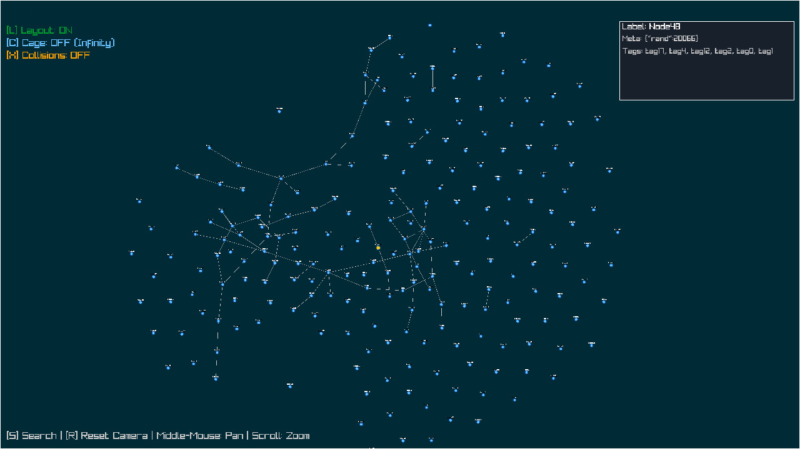
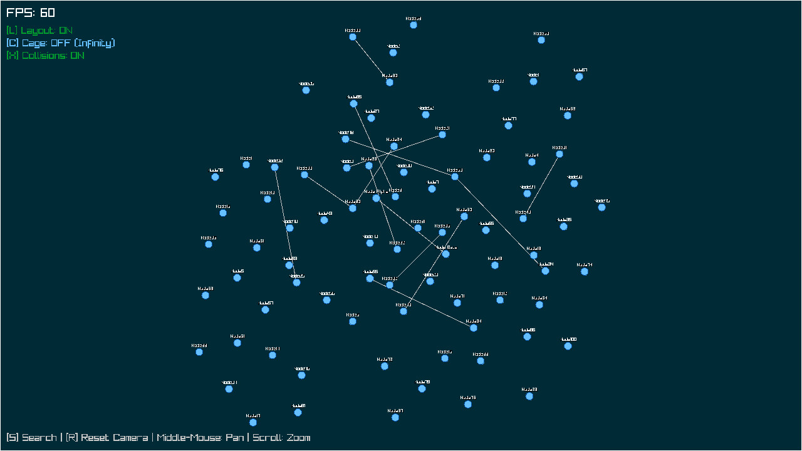

# Realtime Graph Visualizer

[](LICENSE)
[](https://en.wikipedia.org/wiki/C_(programming_language))
[](https://www.raylib.com/)
[](https://www.sqlite.org/)

A high‑performance, real‑time graph visualizer with an interactive force‑directed layout, an HTTP API, and persistent storage. This C implementation is the main version, fully rewritten from an earlier Python prototype for better speed and lower resource usage.


*Interactive graph layout with tag search, collision handling, and an “infinite canvas” mode.*

## ✨ Features

* **Multiple Layouts** – Choose between force‑directed (real‑time physical simulation), depth‑based tree layout, and simple grid layout.
* **Interactive UI** – Pan, zoom, select nodes, and search by tags.
* **Toggleable Options** – Layout animation, collision resolution, and infinite canvas (cage) mode.
* **HTTP API** – RESTful endpoints to manage nodes, edges, and tags dynamically.
* **Persistent Storage** – SQLite (in‑memory by default, easily switched to a file).
* **Multi‑threaded** – HTTP server runs on a separate thread; graph updates are queued and applied safely.
* **Node Metadata** – Store arbitrary JSON metadata per node.
* **Offline Layout** – A Python script runs Graphviz layout engines (`sfdp`, `neato`, `dot`) offline and updates the database.
* **Real‑time Updates** – Add, delete, or modify elements via the API while the visualisation runs.
* **Background Layout Thread** – Offload layout computations to a background thread, keeping the UI responsive for large graphs.

## 📸 Screenshots

| Simple example showing many nodes | Node detail panel and search |
|-----------------------------------|------------------------------|
|  |  |

## 🚀 Getting Started

### Dependencies

Ensure the following libraries are installed:

* [raylib](https://www.raylib.com/) – graphics and input handling
* [SQLite3](https://www.sqlite.org/) – node/edge/tag storage
* [libmicrohttpd](https://www.gnu.org/software/libmicrohttpd/) – HTTP server
* [cJSON](https://github.com/DaveGamble/cJSON) – JSON parsing
* [uthash](https://troydhanson.github.io/uthash/) – hash tables (header‑only)
* [pthreads](https://en.wikipedia.org/wiki/Pthreads) – threading support

For offline layout, you also need **Graphviz**:

```bash
# On Debian/Ubuntu
sudo apt install graphviz

# On macOS
brew install graphviz

# On NixOS/nix
nix-shell -p graphviz
```

On **NixOS** or with **nix**, you can use the provided `shell.nix` to get all dependencies:
```bash
nix-shell
```

### Build

The project includes a simple `build.sh` script:
```bash
chmod +x build.sh
./build.sh
```

Or compile manually (example with `gcc`):
```bash
gcc -o graph_visualizer main.c -lraylib -lsqlite3 -lmicrohttpd -lcjson -lpthread -lm
```

### Run

```bash
./graph_visualizer
```

The visualisation window will open. The HTTP server starts automatically on port `5000` by default. You can specify a persistent database file using the `--db` flag:
```bash
./graph_visualizer --db graph.db
```

### Command‑Line Options

```
--db <file>               Use a file‑based SQLite database instead of in‑memory.
--spatial                 Enable grid‑based spatial acceleration for force layout.
--background-layout       Run force layout in a background thread.
--layout-mode=force|tree|grid
                          Select layout algorithm.
--log-http                Log HTTP requests.
--log-db                  Log database operations.
--log-ui                  Log UI messages.
--ui-batch-size N         Process UI messages in batches (default 5).
```

## 🎮 Keyboard & Mouse Controls

| Action               | Control                          |
|----------------------|----------------------------------|
| **Pan**              | Right mouse button + drag        |
| **Zoom**             | Mouse wheel                      |
| **Reset camera**     | `R`                              |
| **Toggle layout**    | `L`                              |
| **Toggle cage mode** | `C` (bounding box vs. infinite)  |
| **Toggle collisions**| `X`                              |
| **Search by tag**    | `S` (then type, press Enter)     |
| **Select node**      | Left click                       |

> **Cage mode OFF** – nodes can move anywhere (infinite canvas).  
> **Cage mode ON** – nodes stay inside the window boundaries.

## 🌐 HTTP API

The server listens on `http://localhost:5000`. All endpoints expect and return JSON.

### Nodes

| Method | Endpoint       | Description                      |
|--------|----------------|----------------------------------|
| `POST` | `/nodes`       | Create a new node                |
| `GET`  | `/nodes`       | List all nodes (filter by `?tag=`) |
| `DELETE` | `/nodes/{id}` | Delete a node and its edges      |

**POST /nodes** example payload:
```json
{
  "id": "node123",
  "label": "My Node",
  "metadata": { "type": "server", "value": 42 },
  "tags": ["database", "critical"]
}
```

**GET /nodes?tag=database** – returns nodes having that tag.

### Edges

| Method | Endpoint                     | Description                 |
|--------|------------------------------|-----------------------------|
| `POST` | `/edges`                     | Create an edge between two nodes |
| `DELETE` | `/edges?source=A&target=B` | Delete a specific edge       |

**POST /edges** payload:
```json
{
  "source": "node123",
  "target": "node456"
}
```

### Tags

| Method | Endpoint                    | Description                  |
|--------|-----------------------------|------------------------------|
| `POST` | `/nodes/{id}/tags`          | Add tags to an existing node |

**POST /nodes/node123/tags** payload:
```json
{
  "tags": ["newtag", "updated"]
}
```

### Graph dump

| Method | Endpoint | Description |
|--------|----------|-------------|
| `GET`  | `/graph` | Returns all nodes and edges in one object |

## 🗄️ Offline Layout with Graphviz

The `offline_layout_sqlite.py` script lets you compute high‑quality node positions using Graphviz and update the database without any runtime overhead.

### Usage

```bash
python3 offline_layout_sqlite.py --db graph.db --mode sfdp [--output new.db]
```

Options:
* `--mode {sfdp,neato,dot}` – Graphviz layout engine (default: `sfdp`).
  * `sfdp` – scalable force‑directed, best for large graphs.
  * `neato` – suitable for moderate‑sized graphs.
  * `dot` – hierarchical layout, ideal for directed trees.
* `--db <file>` – input SQLite database file.
* `--output <file>` – output SQLite file (if not given, overwrites input).

### How it works

1. Reads the graph (nodes, edges) from the SQLite database.
2. Converts the graph to DOT format with proper quoting.
3. Runs the chosen Graphviz engine with JSON output.
4. Parses the JSON, extracts node coordinates, and flips the Y axis (because Graphviz uses bottom‑left origin while the visualizer uses top‑left).
5. Updates the `nodes` table in the database with the new positions.

### Example workflow

```bash
# Start the visualizer with a persistent database
./graph_visualizer --db graph.db

# Populate the graph via API (or load initial data)

# Stop the visualizer (or leave it running; the database will be updated on disk)

# Run offline layout
python3 offline_layout_sqlite.py --db graph.db --mode sfdp

# Restart the visualizer to see the new positions
./graph_visualizer --db graph.db
```

## 🧠 Architecture

* **Main thread** – runs the raylib graphics loop, processes user input, and updates the force layout.
* **HTTP thread** – runs libmicrohttpd, parses JSON, and pushes messages into a thread‑safe queue.
* **Database thread** – processes tasks (add/delete nodes/edges/tags) using a single persistent SQLite connection.
* **Layout thread** (optional) – runs force layout on a separate copy of the graph and sends batched position updates to the UI queue.
* **Message queues** – holds `ADD_NODE`, `ADD_EDGE`, `DELETE_NODE`, etc. messages to avoid concurrent modification of the graph data.
* **Double‑buffered graph** – when background layout is enabled, the UI and layout threads work on independent copies, swapped via queue messages.
* **In‑memory structures** – nodes stored with uthash hash tables; edges stored in a hash set and a linear array for fast iteration.

## 📁 Project Structure

```
.
├── main.c                    – Single‑file implementation
├── offline_layout_sqlite.py – Python script for Graphviz offline layout
├── build.sh                  – Quick build script
├── shell.nix                 – Nix development environment
├── blob/                     – Screenshot images
└── README.md                 – This file
```

## 🤝 Contributing

Contributions are welcome! Please open an issue or pull request on the [GitHub repository](https://github.com/haller33/RealtimeGraphVisualizer).

## 📄 License

This project is licensed under the MIT License. See the [LICENSE](LICENSE) file for details.

## 🙏 Acknowledgements

* [Raylib](https://www.raylib.com/) – simple and powerful graphics library.
* [cJSON](https://github.com/DaveGamble/cJSON) – lightweight JSON parser.
* [libmicrohttpd](https://www.gnu.org/software/libmicrohttpd/) – embedded HTTP server.
* [uthash](https://troydhanson.github.io/uthash/) – convenient hash table macros.
* [Graphviz](https://graphviz.org/) – high‑quality graph layout engines.
* The original Python prototype – inspiration for the features.

---

*Built with ❤️ in C*
