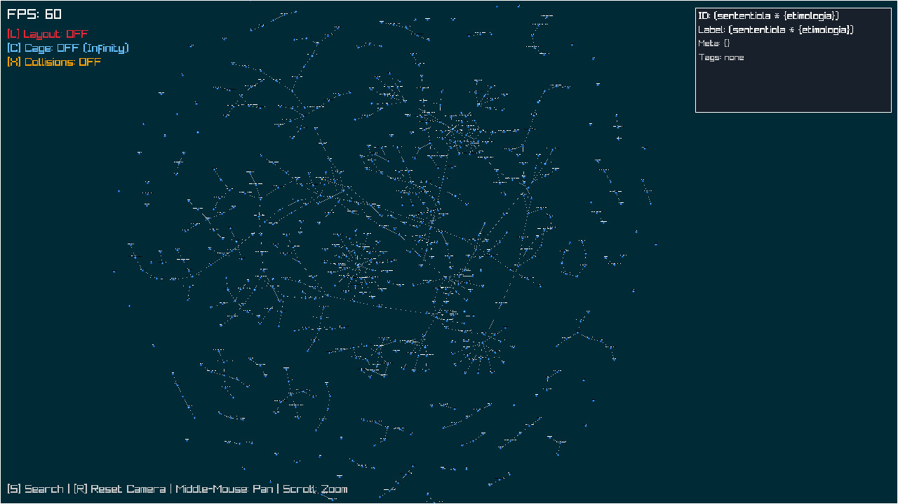
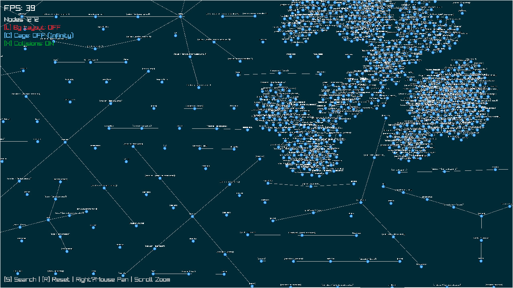
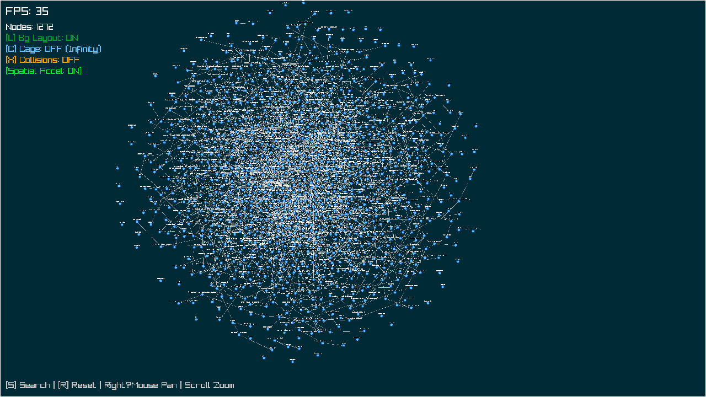

# Realtime Graph Visualizer

[](LICENSE)
[](https://en.wikipedia.org/wiki/C_(programming_language))
[](https://www.raylib.com/)
[](https://www.sqlite.org/)

A high‑performance, real‑time graph visualizer with multiple layout engines, an HTTP API, and persistent storage. **This C implementation is the main version** – fully rewritten from an earlier Python prototype for better speed and lower resource usage.


*Interactive graph layout with tag search, collision handling, and an “infinite canvas” mode.*

## 📸 Screenshots

| Force‑directed layout (organic) | Tree layout | Grid layout |
|--------------------------------|-------------|--------------|
|    |  |  |

| Large graph via API | Node detail and search | Offline preprocessing |
|--------------------|------------------------|----------------------|
|  |  |  |

*From left to right: organic force‑directed layout, hierarchical tree layout, grid layout; API insertion with many nodes, node detail panel, offline layout via Graphviz.*

## ✨ Features

- **Multiple Layouts** – choose between:
  - **Force‑directed** – real‑time physical simulation (repulsion, attraction, damping) with optional grid acceleration (`--spatial`).
  - **Tree layout** – depth‑based hierarchical placement, perfect for trees and DAGs (instant, O(N log N)).
  - **Grid layout** – simple alphabetical grid (instant, O(N log N)).
- **Interactive UI** – pan (right mouse), zoom (scroll), select nodes (left click), search by tag (`S`).
- **Toggleable Options** – layout animation (`L`), collision resolution (`X`), infinite canvas / cage mode (`C`).
- **HTTP API** – RESTful endpoints to manage nodes, edges, and tags dynamically.
- **Persistent Storage** – SQLite (in‑memory by default, file‑based with `--db` flag).
- **Multi‑threaded Architecture** – HTTP, database, and (optionally) layout run in separate threads.
- **Background Layout Thread** – offload force layout to a background thread (`--background-layout`); UI stays responsive even for large graphs.
- **Offline Layout** – Python script (`offline_layout_sqlite.py`) uses Graphviz engines (`sfdp`, `neato`, `dot`) to compute high‑quality positions and updates the database.
- **Node Metadata** – store arbitrary JSON metadata per node.
- **Tag Search** – highlight nodes by tag.

## 🚀 Getting Started

### Dependencies

Install the required libraries:

- [raylib](https://www.raylib.com/) – graphics
- [SQLite3](https://www.sqlite.org/) – database
- [libmicrohttpd](https://www.gnu.org/software/libmicrohttpd/) – HTTP server
- [cJSON](https://github.com/DaveGamble/cJSON) – JSON parsing
- [uthash](https://troydhanson.github.io/uthash/) – hash tables (header‑only)
- pthreads – threading

For offline layout, also install **Graphviz**:
```bash
# Debian/Ubuntu
sudo apt install graphviz

# macOS
brew install graphviz
```

On **NixOS** or with **nix**, use the provided `shell.nix`:
```bash
nix-shell
```

### Build

```bash
chmod +x build.sh
./build.sh
```

Or manually:
```bash
gcc -o graph_visualizer main.c -lraylib -lsqlite3 -lmicrohttpd -lcjson -lpthread -lm
```

### Run

```bash
./graph_visualizer
```

Use command‑line flags to customise:
```bash
# Use a file‑based database
./graph_visualizer --db graph.db

# Enable spatial acceleration and background layout
./graph_visualizer --spatial --background-layout

# Use tree layout (disables dynamic layout)
./graph_visualizer --layout-mode=tree

# Grid layout
./graph_visualizer --layout-mode=grid
```

### Command‑Line Options

| Flag | Description |
|------|-------------|
| `--db <file>` | Use a file‑based SQLite database (default: in‑memory). |
| `--spatial` | Enable grid‑based spatial acceleration for force layout. |
| `--background-layout` | Run force layout in a background thread (keeps UI smooth). |
| `--layout-mode=force|tree|grid` | Select layout algorithm (default: force). |
| `--log-http`, `--log-db`, `--log-ui` | Enable logging for the respective component. |
| `--ui-batch-size N` | Process UI messages in batches (default 5). |

## 🎮 Keyboard & Mouse Controls

| Action               | Control                          |
|----------------------|----------------------------------|
| **Pan**              | Right mouse button + drag        |
| **Zoom**             | Mouse wheel                      |
| **Reset camera**     | `R`                              |
| **Toggle layout**    | `L` (force mode only)            |
| **Toggle cage mode** | `C` (bounding box vs. infinite)  |
| **Toggle collisions**| `X`                              |
| **Search by tag**    | `S` (then type, press Enter)     |
| **Select node**      | Left click                       |

> **Cage mode OFF** – nodes can move anywhere (infinite canvas).  
> **Cage mode ON** – nodes stay inside the window boundaries.

## 🌐 HTTP API

The server runs on `http://localhost:5000`. All endpoints expect and return JSON.

### Nodes

| Method | Endpoint       | Description                      |
|--------|----------------|----------------------------------|
| `POST` | `/nodes`       | Create a new node                |
| `GET`  | `/nodes`       | List all nodes (filter by `?tag=`) |
| `DELETE` | `/nodes/{id}` | Delete a node and its edges      |

**POST /nodes** example:
```json
{
  "id": "node123",
  "label": "My Node",
  "metadata": { "type": "server", "value": 42 },
  "tags": ["database", "critical"]
}
```

**GET /nodes?tag=database** – returns nodes having that tag.

### Edges

| Method | Endpoint                     | Description                 |
|--------|------------------------------|-----------------------------|
| `POST` | `/edges`                     | Create an edge              |
| `DELETE` | `/edges?source=A&target=B` | Delete a specific edge       |

**POST /edges** payload:
```json
{
  "source": "node123",
  "target": "node456"
}
```

### Tags

| Method | Endpoint                    | Description                  |
|--------|-----------------------------|------------------------------|
| `POST` | `/nodes/{id}/tags`          | Add tags to an existing node |

**POST /nodes/node123/tags** payload:
```json
{
  "tags": ["newtag", "updated"]
}
```

### Graph dump

| Method | Endpoint | Description |
|--------|----------|-------------|
| `GET`  | `/graph` | Returns all nodes and edges in one object |

## 🗄️ Offline Layout with Graphviz

The `offline_layout_sqlite.py` script uses Graphviz to compute high‑quality node positions offline, then updates the database.

### Usage

```bash
python3 offline_layout_sqlite.py --db graph.db --mode sfdp [--output new.db]
```

Options:
- `--mode {sfdp,neato,dot}` – layout engine (sfdp for large graphs, neato for medium, dot for hierarchies).
- `--db` – input SQLite database file.
- `--output` – output file (if omitted, overwrites input).

### Example

```bash
# Start visualizer with persistent database
./graph_visualizer --db graph.db

# Populate graph via API (or load sample data)

# Stop visualizer (or leave it running; changes are saved to disk)

# Run offline layout
python3 offline_layout_sqlite.py --db graph.db --mode sfdp

# Restart visualizer to see new positions
./graph_visualizer --db graph.db
```

The script extracts the graph, runs Graphviz, parses JSON output, flips Y‑axis coordinates, and updates the `nodes` table.

## 🧠 Architecture

- **Main thread** – raylib graphics loop, input handling, drawing.
- **HTTP thread** – libmicrohttpd server, parses JSON, pushes tasks to a message queue.
- **Database thread** – consumes tasks, uses a persistent SQLite connection.
- **Layout thread** (optional) – runs force layout on a separate graph copy and sends batched position updates to the UI queue.
- **Double‑buffered graph** – when background layout is enabled, the UI and layout threads work on independent copies, swapped via queue messages, eliminating locks and flicker.
- **Message queues** – thread‑safe queues (add node, add edge, position updates, etc.).
- **Data structures** – uthash for hash tables (nodes, edges, tags), linear arrays for edge lists.

## 📁 Project Structure

```
.
├── main.c                       – Single‑file C implementation
├── offline_layout_sqlite.py     – Python script for Graphviz offline layout
├── build.sh                     – Build script
├── shell.nix                    – Nix environment
├── blob/                        – Screenshot images
│   ├── good_view.jpg
│   ├── large_api_insert.png
│   ├── larg_organic.jpg
│   ├── offline_pre_processing.jpg
│   └── simple_example.jpg
└── README.md                    – This file
```

## 🤝 Contributing

Contributions are welcome! Please open an issue or pull request on the [GitHub repository](https://github.com/haller33/RealtimeGraphVisualizer).

## 📄 License

This project is licensed under the MIT License. See the [LICENSE](LICENSE) file for details.

## 🙏 Acknowledgements

- [Raylib](https://www.raylib.com/)
- [cJSON](https://github.com/DaveGamble/cJSON)
- [libmicrohttpd](https://www.gnu.org/software/libmicrohttpd/)
- [uthash](https://troydhanson.github.io/uthash/)
- [Graphviz](https://graphviz.org/)
- The original Python prototype

---

*Built with ❤️ in C*
